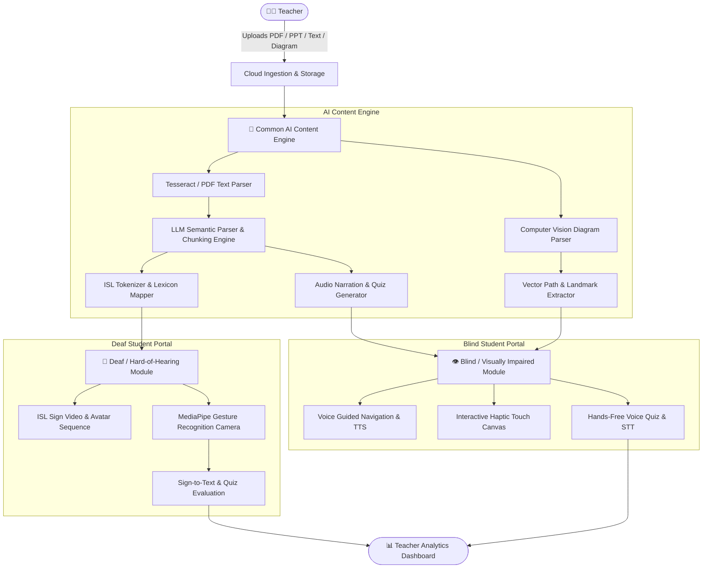
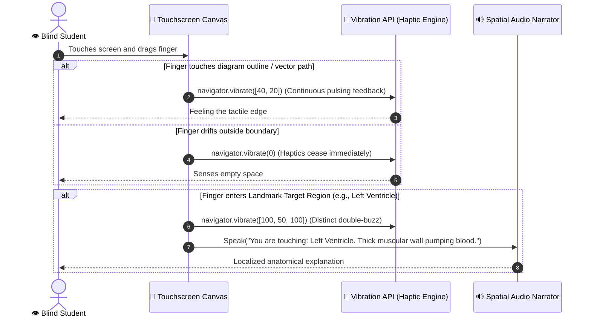

# 🎓 InclusiveAI: AI-Powered Inclusive Education Platform
> **Tagline:** *"UPLOAD ONCE → LEARN WITHOUT BARRIERS"*  
> **Core Mission:** "ONE LESSON → AI CONTENT ENGINE → MULTIPLE ACCESSIBLE LEARNING EXPERIENCES"

---

## 📌 1. The Problem
Special education classrooms and inclusive schools face a massive content fragmentation crisis:
* **Severe Resource Scarcity:** Teachers lack the specialized skills, tools, and time to manually translate every lesson plan into Indian Sign Language (ISL) videos, audio narrations, tactile diagram representations, and accessible quizzes.
* **Siloed Learning Environments:** Students with hearing impairments (Deaf / Hard-of-Hearing) and visual impairments (Blind / Low Vision) are often segregated or left behind because general educational materials (textbooks, PDFs, PPT slides) are completely inaccessible out of the box.
* **Diagram & STEM Learning Void for the Blind:** While screen readers convert plain text to speech, visual STEM diagrams (e.g., biological anatomy, circuits, geometric shapes) remain black boxes. Physical tactile embossed sheets are expensive, brittle, and not on-demand.
* **Lack of Two-Way Classroom Interactivity:** Deaf students lack automated tools to practice sign language gestures with real-time feedback, and teachers rarely know sign language to assess their homework.

---

## 💡 2. The Solution
**InclusiveAI** is a unified, multimodal educational platform. A single educator uploads standard classroom curriculum materials (**PDF / PPT / Text / Diagrams**) once. A centralized **AI Content Engine** ingests, parses, extracts, and semantically structures the content, automatically generating two parallel, synchronized learning modalities:

1. 🤟 **Deaf & Hard-of-Hearing (DHH) Module:**
   * Text-to-Indian Sign Language (ISL) animated avatar / video sequencing.
   * Interactive camera-based Sign Language gesture practice powered by MediaPipe Computer Vision with real-time accuracy scoring.
   * Two-way sign-to-text translation bridging communication between deaf students and teachers.
2. 👁️ **Blind & Visually Impaired (BVI) Module:**
   * Context-aware Text-to-Speech (TTS) and voice-controlled interactive lesson reader.
   * AI-generated deep semantic diagram narrations.
   * **Haptic Diagram Learning:** Touchscreen outline tracing paired with Web Vibration API feedback and localized spatial audio landmark callouts.
   * Fully hands-free Voice Quiz with Speech-to-Text (STT) and automated semantic answer evaluation.

---

## ⚙️ 3. How the System Works (End-to-End Workflow)



---

## 🤟 4. Deaf / Hard-of-Hearing (DHH) Module
Designed for visual-spatial first learning with zero reliance on acoustic cues:
* **Curriculum to ISL Sequence:** Lessons are parsed into lemmatized grammatical tokens and mapped to high-fidelity Indian Sign Language (ISL) video clips and animated avatars.
* **Educational Domain Vocabulary (Prototype Scope):** Focuses on core STEM and classroom terminology: *Science, Photosynthesis, Plant, Sunlight, Water, Oxygen, Carbon Dioxide, Teacher, Student, Question, Answer, Heart, Cell, Energy*.
* **Real-Time Sign Practice (Computer Vision):**
  * Uses the student's standard webcam/mobile camera.
  * MediaPipe Hands & Pose models extract 21 3D hand landmarks and body posture in real-time on-device.
  * Cosine similarity and dynamic time warping (DTW) compare the student's hand gesture against reference gesture coordinate models.
  * Provides visual colored feedback (Green: Correct 90%+, Yellow: Minor deviation, Red: Adjust finger positioning).
* **Two-Way Communication (Sign-to-Text):**
  * Student performs a sign to answer a question or send a message.
  * The system recognizes the gesture stream, translates it into natural text, and delivers it directly to the teacher's dashboard.

---

## 👁️ 5. Blind / Visually Impaired (BVI) Module
Designed with a non-visual, screenless-first philosophy:
* **Audio-First Interactive Reader:** High-clarity synthetic speech (via Web Speech API / Cloud TTS) with customizable speech rate, pitch, and pitch modulation for distinct concepts (headings vs. explanations).
* **AI Diagram Audio Description:** Ingested images are segmented by the AI Engine to generate multi-tiered audio descriptions:
  1. High-level summary (e.g., *"Cross-section diagram of the human heart showing 4 chambers."*)
  2. Sequential structural breakdown (e.g., *"Blood flow path from Right Atrium to Pulmonary Artery."*)
* **Hands-Free Voice Navigation:**
  * Powered by Web Speech Recognition (`SpeechRecognition` API) with continuous wake-word listening.
  * Voice commands: *"Next Page"*, *"Repeat"*, *"Explain Diagram"*, *"Start Quiz"*, *"Submit Answer"*.
* **Interactive Voice Quiz:**
  * System speaks a question aloud.
  * Student speaks their explanation.
  * Speech-to-Text transcribes the audio, and the NLP semantic grader assesses conceptual understanding rather than strict word matching.

---

## 📳 6. Unique Innovation: Haptic Diagram Learning
### *Making STEM Diagrams Tactile on Any Standard Touchscreen*



### Technical Implementation (Realistic Prototype Design):
1. **Vector & Coordinate Grid Mapping:** Diagrams (e.g., Human Heart, Plant Cell, Solar System) are vectorized into continuous boundary line coordinates and designated circular/polygonal `POI` (Points of Interest) hitboxes.
2. **Touch Tracking:** High-frequency `PointerEvent` tracking (`pointerdown`, `pointermove`) on an HTML5 `<canvas>` calculates the Euclidean distance between the user's touch coordinate $(x_t, y_t)$ and the closest path segment $(x_p, y_p)$.
3. **Thresholded Haptic Pulse:**
   * If distance $d \le \text{Threshold}$ (e.g., 18px), triggers `navigator.vibrate([35, 15])`.
   * If distance $d > \text{Threshold}$, vibration stops, allowing the student to mentally trace boundaries.
4. **Landmark Hit Detection:** Entering a designated POI bounding box triggers an elevated haptic confirmation and automatic speech synthesis of that exact component's name and function.

> **Honest Prototype Boundary:** We realistically frame this as a precision-calibrated vector coordinate mapping system for curriculum diagrams, delivering high-utility spatial cognition without claiming unassisted single-vibration raster reproduction.

---

## 🧠 7. Common AI Content Engine
The core backend processing pipeline converts raw unstructured uploads into modular accessible artifacts:

```
                      ┌────────────────────────────────────────┐
                      │   Raw File (PDF / PPT / Text / Image)  │
                      └───────────────────┬────────────────────┘
                                          │
                                          ▼
                      ┌────────────────────────────────────────┐
                      │  Extraction Layer (OCR & PDF Parser)   │
                      └───────────────────┬────────────────────┘
                                          │
                                          ▼
                      ┌────────────────────────────────────────┐
                      │    NLP Semantic Structuring Engine     │
                      │ • Chunking into logical lesson units   │
                      │ • Generating simplified glosses        │
                      │ • Extracting question & answer pairs   │
                      └─────────┬────────────────────┬─────────┘
                                │                    │
              ┌─────────────────┴──────┐      ┌──────┴────────────────┐
              │                        │      │                       │
              ▼                        ▼      ▼                       ▼
    ┌──────────────────┐     ┌──────────────┐ ┌──────────────┐ ┌──────────────┐
    │ ISL Token Stream │     │Sign Practice │ │Audio Script  │ │Haptic POI    │
    │ & Lexicon IDs    │     │Target Vectors│ │& Voice Quiz  │ │Coordinates   │
    └──────────────────┘     └──────────────┘ └──────────────┘ └──────────────┘
```

---

## 👩‍🏫 8. Teacher Dashboard
Empowers any general educator to manage inclusive classrooms effortlessly:
* **One-Click Lesson Ingestion:** Drag-and-drop PDF, PPTX, or text documents with automatic accessibility preview generation.
* **Curriculum & Quiz Builder:** View and edit AI-generated quizzes for both sign-based and voice-based completion.
* **Unified Accessibility Progress Tracker:**
  * Track Deaf students' sign accuracy scores (MediaPipe gesture match percentages).
  * Track Blind students' voice quiz scores, audio completion rates, and diagram exploration times.
* **Student Roster & Preference Tuning:** Configure vibration intensity, speech rates, and custom ISL vocabulary additions.

---

## 🎒 9. Student Dashboards

| Feature | 🤟 Deaf Student Experience | 👁️ Blind Student Experience |
| :--- | :--- | :--- |
| **Primary Output** | Synchronized ISL Video / Animated Avatar + Visual Captions | Screen-Reader Friendly High-Fidelity TTS + Audio Descriptions |
| **Interactive Practice** | Webcam MediaPipe Gesture Recognition with live accuracy feedback | Haptic Touchscreen Diagram Tracing with spatial vibration |
| **Assessment Mode** | Sign-to-Text & Interactive Visual Quizzes | 100% Hands-Free Voice-to-Text Q&A Evaluation |
| **Navigation** | High-contrast visual layout, visual flash notifications | Continuous Voice Command Navigation & Screen Reader ARIA cues |

---

## 💻 10. Technology Stack

```
Frontend:
├── React.js / Vite (SPA architecture for low latency)
├── Tailwind CSS (High-contrast accessibility theme & accessible UI components)
├── HTML5 Canvas & Pointer Events API (Haptic Diagram Canvas)
└── Lucide Icons (Accessible iconography)

Hardware & Web Accessibility APIs:
├── Web Speech API (SpeechSynthesis for TTS, SpeechRecognition for Voice UI)
├── Web Vibration API (navigator.vibrate for haptic feedback)
└── Web Camera API (MediaStreams for real-time video feed)

AI / Computer Vision / NLP:
├── Google MediaPipe Hands & Pose (Client-side real-time 3D landmark extraction)
├── Tesseract.js / PDF.js (Client & Server OCR and document parsing)
├── NLP Lemmatization & Grammar Parser (Text to ISL gloss mapping)
└── LLM Integration (OpenAI / Gemini API for content structuring and quiz generation)

Backend & Persistence:
├── Node.js & Express.js (RESTful API & content processing services)
├── MongoDB / Supabase (Lesson metadata, user progress, gesture coordinate vectors)
└── Supabase Storage / Local Blob Store (Diagrams, audio assets, ISL video clips)
```

---

## 📖 11. Real-Life Example Walkthrough

### Scenario: Grade 9 Science — *"Photosynthesis & The Leaf Structure"*
1. **Teacher Uploads:** Mrs. Sharma uploads `Class9_Photosynthesis.pdf` (contains text + a diagram of a leaf cross-section and chloroplast).
2. **AI Processing:**
   * Text is parsed into core concepts: Light energy, Chlorophyll, Glucose, Stomata.
   * Diagram is mapped into vector contours for the leaf vein, stomata, and chloroplast cell wall.
3. **Deaf Student (Rohan):**
   * Rohan opens the lesson: watches ISL video sequence explaining how plants absorb light.
   * Rohan clicks "Practice Signs": camera turns on, prompts him to sign *"Sunlight"* and *"Plant"*.
   * MediaPipe checks his hand orientation and assigns a **95% accuracy score**, saving his results.
4. **Blind Student (Ananya):**
   * Ananya opens the app and says *"Start Lesson"*. The app greets her and reads the concept aloud.
   * She says *"Explore Diagram"*. She places her finger on the screen; vibrating pulses guide her along the stomatal pore.
   * As her finger reaches the center, a double buzz triggers: *"You are touching: Guard Cells regulating gas exchange."*
   * She takes the voice quiz completely hands-free by speaking her answers.
5. **Teacher Insight:** Mrs. Sharma opens her dashboard and sees Rohan’s sign accuracy and Ananya’s voice quiz breakdown—both learning from the same original PDF upload.

---

## 🚀 12. Key Innovations & Differentiators

1. **Universal Lesson Ingestion (Zero Redundancy):** Solves the single biggest blocker in inclusive education—teachers do not need to create 3 separate curricula.
2. **First-of-its-kind Haptic Diagram Tracing on Standard Web Tech:** Converts everyday consumer smartphones and tablets into tactile learning surfaces without requiring expensive refreshable braille displays ($3,000+).
3. **Edge-Based MediaPipe Gesture Feedback:** Performs real-time gesture evaluation locally inside the student's browser with zero cloud latency and full privacy protection.
4. **Symmetric Multimodality:** Supports both input and output accessibility (Sign $\leftrightarrow$ Text, Voice $\leftrightarrow$ Audio/Haptics).

---

## ⏱️ 13. The 30-Second Elevator Pitch
> *"Over 15% of the world's population lives with a disability, yet inclusive education remains fragmented because adapting one single lesson for both deaf and blind students takes hours of manual specialist effort.*  
> *With **InclusiveAI**, a teacher uploads a lesson PDF **just once**. Our unified AI engine immediately converts it into **Indian Sign Language avatar videos with real-time AI camera practice** for deaf students, and **voice-guided audio lessons with interactive haptic touchscreen diagrams** for blind students.*  
> *One upload. Zero barriers. True educational equity for every classroom."*

---

## 🏛️ 14. Architecture & Technical Flow

```
+-----------------------------------------------------------------------------------+
|                              TEACHER INGESTION LAYER                              |
|   [ PDF / PPTX / Text Upload ]  ----->  [ Document Extraction & Preprocessing ]   |
+-----------------------------------------------------------------------------------+
                                         |
                                         v
+-----------------------------------------------------------------------------------+
|                            COMMON AI CONTENT ENGINE                               |
|   +---------------------------------------------------------------------------+   |
|   | 1. OCR & Layout Extraction (Tesseract / PDF.js)                           |   |
|   | 2. NLP Semantic Parser (Summarization, Q&A Generation, Glossary)          |   |
|   | 3. Diagram Boundary & Region Extraction (Vector Path & Landmark POIs)     |   |
|   | 4. ISL Grammar & Token Sequencer (Rule-based Gloss Parser)                |   |
|   +---------------------------------------------------------------------------+   |
+-----------------------------------------------------------------------------------+
                                         |
                    +--------------------+--------------------+
                    |                                         |
                    v                                         v
+---------------------------------------+ +---------------------------------------+
|        DEAF STUDENT SUBSYSTEM         | |        BLIND STUDENT SUBSYSTEM        |
|                                       | |                                       |
|  [ ISL Video & Animation Player ]     | |  [ Voice UI & Speech Navigation ]     |
|  - Token-to-video timeline sync       | |  - Web SpeechRecognition engine       |
|                                       | |                                       |
|  [ MediaPipe Hand Tracking Engine ]   | |  [ Haptic Touchscreen Canvas ]        |
|  - 21 3D Landmark feature extraction  | |  - Vector distance calculation        |
|  - Cosine distance gesture evaluation | |  - Web Vibration API pulse feedback   |
|                                       | |  - POI Landmark speech narration      |
|  [ Sign-to-Text Classroom Bridge ]    | |                                       |
|  - Gesture classification to text     | |  [ Hands-Free Voice Assessment ]      |
|  - Live feedback to teacher dashboard | |  - Speech-to-text semantic validation |
+---------------------------------------+ +---------------------------------------+
                    |                                         |
                    +--------------------+--------------------+
                                         |
                                         v
+-----------------------------------------------------------------------------------+
|                        CENTRAL TEACHER ANALYTICS & DB                             |
|  - Real-time gesture accuracy scores  - Voice quiz semantic evaluation logs       |
|  - Roster management                  - Lesson catalog & accessibility previews   |
+-----------------------------------------------------------------------------------+
```
